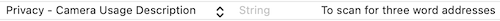

[](https://dl.circleci.com/status-badge/redirect/gh/what3words/w3w-swift-components-ocr/tree/main)
# &nbsp;w3w-swift-components-ocr

Overview
--------

A Swift component library for what3words OCR.  These components can work with either what3words' OCR SDK, or with iOS' [Vision Framework](https://developer.apple.com/documentation/vision).


#### what3words OCR XCFramework

If you want to use what3words' OCR XCFramework `W3WOcrSdk.xcframework`, please contact [what3words](https://what3words.com/contact-us/) to get it.  Otherwise you can use this component as is and rely on iOS's Vision Framework.

#### Swift Package Manager

Use [Swift Package Manager](https://developer.apple.com/documentation/xcode/adding_package_dependencies_to_your_app) and add the URL below:

```
https://github.com/what3words/w3w-swift-components-ocr.git
```

Import the libraries wherever you use the components:

```swift
import W3WSwiftComponentsOcr
import W3WSwiftApi
```

#### Info.plist

You must set the camera permission in your app's `Info.plist`:



Using The Component
-------------------

The component constructor needs an OCR object.  

#### Using the API with Vision Framework:

Our `W3WOcrNative` class that uses iOS' Vision Framework requires our API (or SDK) to be passed into the constructor.

```Swift
  let api = What3WordsV3(apiKey: "YourApiKey")
  let ocr = W3WOcrNative(api)
  let ocrViewController = W3WOcrViewController(ocr: ocr)
```

#### Using the SDK with what3words' OCR SDK:

The what3words OCR SDK requires only a path to the OCR data files, and optionally a language parameter (ISO 2 letter language code).

```Swift
  let ocr = W3WOcr(dataPath: "/path/to/ocr/datafiles", language: "en")
  let ocrViewController = W3WOcrViewController(ocr: ocr)
```

Typical Usage
-------------

Here's a typical use example set in a UIViewController's IBOutlet function that is connected to a UIButton (presuming the initialisation code above was used somewhere in the class):

```Swift
@IBAction func scanButtonPressed(_ sender: Any) {

  // show the OCR ViewController
  self.show(ocrViewController, sender: self)
  
  // start the OCR processing images
  ocrViewController.start()
  
  // when it finds an address, show it in the viewfinder
  ocrViewController.onSuggestions = { [weak self] suggestions in
    if let suggestion = suggestions.first {
      self?.ocrViewController.show(suggestion: suggestion)
      self?.ocrViewController.stop()
  }

  // if there is an error show the user
  ocrViewController.onError = { [weak self] error in
    self?.ocrViewController.stop()
    self?.showError(error: error)
  }
}
```

Example Code
------------

An example called `OcrComponent` can be found [here](Examples/OcrComponent/OcrComponent.xcodeproj/) in the `Examples/OcrComponent` directory of this repository.


### OCR Reference

Both `W3WOcr` and `W3WOcrNative` conform to `W3WOcrProtocol`.  This guarantees the following functions:

`set(language: String)` - sets a language to use.  Langauge codes can be retrieved using the `availableLangauges()` function.

`availableLanguages() -> [String]` - returns an array of language codes that the OCR accepts.


